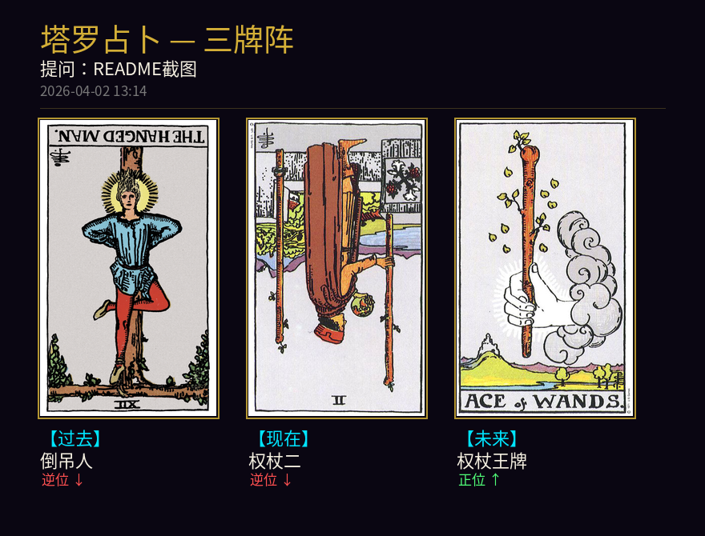

[English](README_EN.md) | 中文

# TarotCC — 在 Claude Code 里算塔罗牌

一个专为 [Claude Code](https://claude.ai/claude-code) 设计的韦特塔罗占卜系统。你只需要在对话中说"帮我算一卦"，Claude 就会化身塔罗占卜师——推荐牌阵、抽牌、展示牌面图片、解读含义，全程在终端对话里完成，不需要离开编辑器。



## 快速开始：全局 `/tarot` 命令

**在任何目录下都能占卜**——这是最推荐的使用方式。只需将项目中的斜杠命令复制到 Claude Code 全局命令目录：

```bash
git clone https://github.com/haozheee/TarotCC.git
cd TarotCC
./install.sh
```

安装脚本会自动创建 conda 环境、安装依赖，并将全局 `/tarot` 命令配置到 `~/.claude/commands/`（路径自动适配，无需手动修改）。

配置完成后，在**任意目录**下启动 Claude Code，输入：

```
/tarot 最近事业运势如何？
```

Claude 会自动进入占卜流程——推荐牌阵、抽牌、展示图片、解读牌面。支持中英双语，Claude 会根据你的语言自动切换。

## 它是怎么工作的

这个项目的核心思路是：**用自定义斜杠命令让 Claude Code 学会塔罗占卜**。

项目里包含一个 Python CLI 工具 (`tarot.py`)，负责抽牌和渲染牌面图片。而 `commands/tarot.md` 定义了完整的占卜工作流——安装为全局命令后，Claude 会在你输入 `/tarot` 时自动读取这些指令：

```
你："/tarot 最近工作压力好大，帮我看看事业运势吧"

Claude：分析你的问题，推荐「事业牌阵」
  ↓
你：确认使用事业牌阵
  ↓
Claude：调用 tarot.py 抽牌，弹出牌面图片窗口
  ↓
Claude：以专业塔罗师的口吻逐张解读，给出建议
  ↓
你：可以追问某张牌、换个问题、或重新抽牌
```

整个过程就像和一位塔罗师对话，只不过这位塔罗师住在你的终端里。

## 功能特性

- **全局 `/tarot` 命令** — 在任何项目目录下都能随时占卜
- **中英双语支持** — Claude 根据用户语言自动切换，`--lang zh/en` 控制输出语言
- **完整 78 张韦特塔罗牌** — 22 张大阿卡纳 + 56 张小阿卡纳，含中文释义
- **7 种经典牌阵** — 单牌、是非牌、三牌（过去/现在/未来）、凯尔特十字、马蹄形、爱情、事业
- **原版韦特牌面图片** — 自动下载并缓存，逆位牌会倒置显示
- **牌阵图片渲染** — 每种牌阵按传统布局排列，生成一张完整的牌面图
- **Tkinter 弹窗展示** — 抽牌后自动弹出图片窗口，跨平台可用

## 在项目目录内使用

如果你不想配置全局命令，也可以直接在项目目录内使用：

```bash
cd TarotCC
claude
```

项目内的 `CLAUDE.md` 会让 Claude 自动学会占卜——直接说"帮我算一卦"即可，不需要 `/tarot` 命令。

## CLI 直接使用

也可以跳过 Claude，直接在命令行用：

```bash
# 抽一张牌
python tarot.py draw

# 三牌阵 + 提问（英文输出）
python tarot.py --lang en spread three -q "Where should I focus?"

# 凯尔特十字 + 弹出图片
python tarot.py spread cross -q "深度分析" -s

# 查看所有牌阵
python tarot.py spreads

# 查询某张牌的含义
python tarot.py card "愚者"
python tarot.py card "The Fool"

# 列出全部 78 张牌
python tarot.py deck
```

**参数说明：**
- `--lang zh|en` — 输出语言（默认中文）
- `-q` / `--question` — 附带你的问题
- `-s` / `--show` — 弹出 tkinter 窗口展示牌面图片

## 牌阵一览

| 牌阵 | 牌数 | 布局 | 适用场景 |
|------|------|------|----------|
| `single` | 1 | 单牌 | 每日运势、简单问题 |
| `yesno` | 1 | 单牌 + 是非倾向 | 是/否选择题 |
| `three` | 3 | 过去 - 现在 - 未来 | 事情发展趋势 |
| `cross` | 10 | 凯尔特十字 + 权杖柱 | 需要深度全面分析 |
| `horseshoe` | 7 | U 形弧线 | 综合指引 |
| `love` | 6 | 心形对称 | 感情/关系问题 |
| `career` | 5 | 倒金字塔 | 事业/职业发展 |

## 项目结构

```
TarotCC/
├── CLAUDE.md          # Claude Code 占卜工作流指令
├── install.sh         # 一键安装脚本
├── tarot.py           # CLI 工具（抽牌、渲染图片、多语言）
├── commands/
│   └── tarot.md       # 全局斜杠命令模板（install.sh 自动替换路径）
├── data/
│   ├── cards.json     # 78 张韦特塔罗牌数据（含中文释义）
│   └── img_cache/     # 牌面图片缓存（自动下载）
├── assets/            # 示例图片
└── README.md
```

## 技术细节

1. `tarot.py` 从 `data/cards.json` 加载 78 张牌的完整数据
2. 随机抽牌，每张牌有约 50% 概率逆位
3. 使用 Pillow 将韦特原版牌面图片按牌阵布局拼合为一张 PNG
4. 牌面图片首次使用时从网络下载，缓存在 `data/img_cache/`
5. `--lang` 参数控制 CLI 输出和图片渲染的语言（中/英）
6. Claude Code 读取抽牌结果和图片，以塔罗师身份进行解读

## 牌面图片来源

大阿卡纳图片来自 [Wikimedia Commons](https://commons.wikimedia.org/)（公有领域，1909 年首版）。小阿卡纳图片来自 [tarot-json](https://github.com/metabismuth/tarot-json)。所有韦特塔罗牌面图片均属公有领域。

## 许可证

MIT
